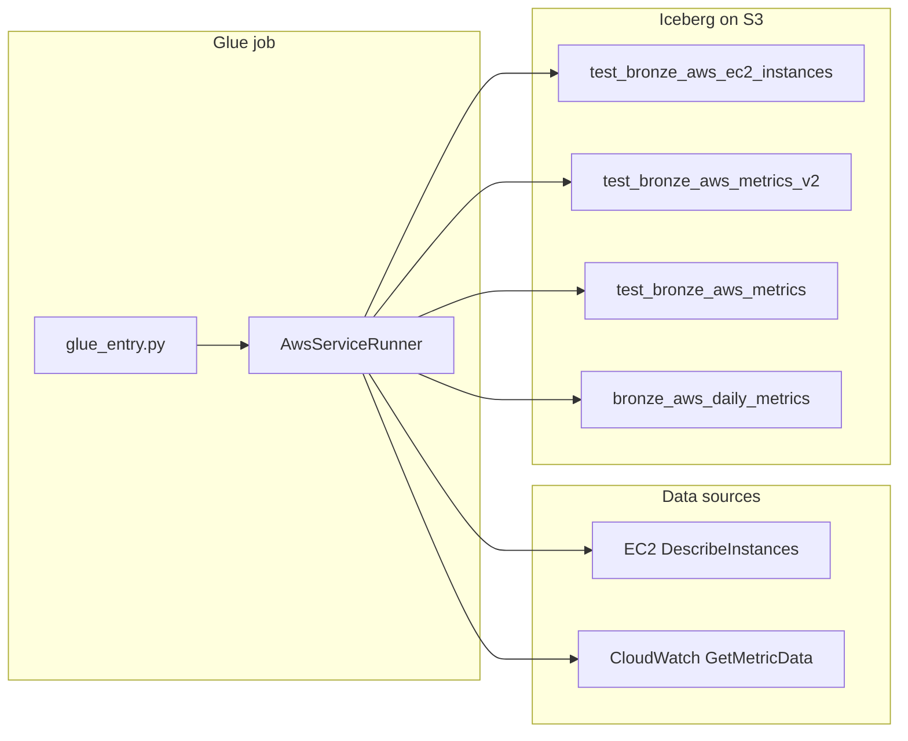

# Proof of concept: AWS EC2 bronze ingestion

This document describes the Finomics-style **bronze layer** for **Amazon EC2**, implemented under `EC2-POC/aws-ec2-bronze/`. The design follows the same ideas as the Azure bronze package (`finomics-custom-recs-bronze`): declarative service config, resource inventory plus monitoring metrics, Iceberg upserts, and a daily rollup for downstream recommendation rules (for example **idle** and **overprovisioned** EC2).

---

## 1. Objectives

- Ingest **EC2 instance inventory** (all instances returned by `DescribeInstances` in each configured Region).
- Ingest **CloudWatch metrics** aligned with rightsizing signals: CPU, memory (when available), network, instance disk bytes, and **aggregated EBS volume IOPS** (read/write ops) per instance.
- Persist data in **Apache Iceberg** on **S3** using the **AWS Glue** catalog, with MERGE semantics on natural keys.
- Support **multi-Region** runs (one Glue pass loops Regions, similar to multi-subscription loops on Azure).

---

## 2. High-level architecture



1. **Phase A (parallel where applicable):** For each active service (currently **EC2**), call AWS APIs to fetch resources and metric time series.
2. **Phase B (sequential writes):** MERGE rows into Iceberg tables. Raw metrics are also **aggregated to daily** values (hourly percentile, then daily average—same pattern as the Azure bronze daily job) and merged into shared daily tables.

Warehouse layout: `s3://{S3_BUCKET}/warehouse/{s3_path_suffix}/` per table config.

---

## 3. Iceberg tables

| Table | S3 path suffix (under `warehouse/`) | Purpose |
|--------|-------------------------------------|---------|
| `test_bronze_aws_ec2_instances` | `aws/ec2_instances` | Instance inventory; natural key includes `client_id`, `account_id`, `resource_id`. |
| `test_bronze_aws_metrics_v2` | `aws/ec2_metrics` | Raw metric points (hourly period **3600s**); key includes `date`, `metric_name`, `aggregation_type`. |
| `test_bronze_aws_metrics` | `aws/metrics_daily` | Daily rollup (shared convention for future AWS services). |
| `bronze_aws_daily_metrics` | `aws/daily_metrics` | Second daily table (mirrors Azure dual daily tables). |

Partitions (instances and metrics): `client_id`, `account_id`, `year_month`.

**Resource identity:** `resource_id` is the instance ARN:

`arn:aws:ec2:{region}:{account_id}:instance/{instance_id}`

**Metadata stamped on rows:** `client_id` (Finomics tenant), `account_id` (12-digit AWS account), `cloud_name` = `aws`, `ingestion_timestamp`, `year_month`, and `job_runtime_utc` where applicable.

---

## 4. CloudWatch metrics

Metrics are declared in `bronze/services/aws/ec2.py`.

### 4.1 Namespace `AWS/EC2` (dimension: `InstanceId`)

| Metric | Statistic | Unit (documented) | Notes |
|--------|-----------|-------------------|--------|
| `CPUUtilization` | Average | Percent | Standard EC2 metric. |
| `MemoryUtilization` | Average | Percent | Often **absent** unless the unified CloudWatch agent publishes it for the instance. Treat missing series as “unknown,” not zero. |
| `NetworkIn` | Sum | Bytes | Sum over the 1-hour period. |
| `NetworkOut` | Sum | Bytes | Sum over the 1-hour period. |
| `DiskReadBytes` | Sum | Bytes | Largely **instance store**; EBS throughput is not fully represented here. |
| `DiskWriteBytes` | Sum | Bytes | Same caveat as disk read. |

### 4.2 Namespace `AWS/EBS` (dimension: `VolumeId`)

| Metric | Statistic | Unit | Notes |
|--------|-----------|------|--------|
| `VolumeReadOps` | Sum | Count | **Per attached EBS volume**, then **summed by timestamp** across all volumes for that instance so bronze exposes **one instance-level series**. |
| `VolumeWriteOps` | Sum | Count | Same aggregation as read ops. |

**References:**

- [Viewing metrics with CloudWatch (EC2)](https://docs.aws.amazon.com/AWSEC2/latest/UserGuide/viewing_metrics_with_cloudwatch.html)
- [EC2 metrics analyzed (Compute Optimizer)](https://docs.aws.amazon.com/compute-optimizer/latest/ug/ec2-metrics-analyzed.html)

---

## 5. AWS Glue job

**Entry module:** `glue_entry.py` (same orchestration style as Azure `finomics-custom-recs-bronze/glue_entry.py`: Spark session, parallel fetch, sequential Iceberg writes).

**Deploy:** zip the `bronze/` package and upload with `glue_entry.py` as the script; see repository **`README.md`**. Use a **dev** vs **prod** Glue job with different **IAM execution roles** and parameters (`S3_BUCKET`, `ICEBERG_DATABASE`, etc.) — no code fork required.

On Glue, `glue_entry` sets **`glue_job_runtime=True`** on `JobParams`: API calls use the **Glue job execution role** only (no `AWS_PROFILE`, no packaged `aws_creds.json`). Optional **`AWS_CREDENTIALS_SECRET`** still loads keys from Secrets Manager if the role may assume another account.

### 5.1 Required job parameters

| Parameter | Description |
|-----------|-------------|
| `JOB_NAME` | Spark app name. |
| `WINDOW_DAYS` | Lookback window for CloudWatch (integer days). |
| `ACTIVE_SERVICES` | Comma-separated; use `EC2` for this POC. |
| `CLIENT_ID` | Finomics client / tenant id (metadata). |
| `S3_BUCKET` | Bucket hosting the Iceberg warehouse prefix. |
| `ICEBERG_DATABASE` | Glue database name for Iceberg tables. |

### 5.2 Optional job parameters

| Parameter | Description |
|-----------|-------------|
| `AWS_ACCOUNT_ID` | 12-digit account; if omitted, resolved via **STS** `GetCallerIdentity`. |
| `AWS_REGIONS` | Comma-separated Regions to scan (e.g. `us-east-1,eu-west-1`). |
| `AWS_REGION` | Alternative single-Region hint (also used when `AWS_REGIONS` is empty). |
| `ICEBERG_CATALOG` | Defaults to `glue_catalog`. |
| `ADDITIONAL_CLIENT_ID` | If set, the same ingested rows are MERGED again with this `client_id` (same pattern as Azure duplicate client). |
| `AWS_CREDENTIALS_SECRET` | Optional Secrets Manager secret id; JSON must include `aws_access_key_id`, `aws_secret_access_key`, optional `aws_session_token`. The **Glue role** must allow `secretsmanager:GetSecretValue`. |
| `AWS_PROFILE` | Parsed for compatibility but **ignored on Glue** — the job role is always used when `glue_job_runtime=True`. |

If `AWS_REGIONS` / `AWS_REGION` are not provided, the job falls back to environment `AWS_REGION` / `AWS_DEFAULT_REGION`, then `us-east-1`.

### 5.3 Authentication (`bronze/auth`)

Mirrors the Azure bronze layout: **`bronze/auth/secrets.py`** (cached `get_secret_json` via Secrets Manager) and **`bronze/auth/aws_auth.py`** (`get_aws_session`).

**Resolution order** for API calls (EC2, CloudWatch, STS):

**On AWS Glue** (`glue_job_runtime=True` in `glue_entry`):

1. Optional secret: **`AWS_CREDENTIALS_SECRET`** / **`FINOMICS_AWS_CREDENTIALS_SECRET`**.
2. Else **`boto3.Session(region_name=...)`** with no profile — **Glue execution role** credentials.

**Locally** (`local_run.py`, `glue_job_runtime=False`):

1. Secret, then local JSON file, then profile / default chain (see `bronze/auth/aws_auth.py`).

Reading a secret that *contains* access keys still requires the caller to have **`secretsmanager:GetSecretValue`** on that secret.

### 5.4 IAM and permissions (POC checklist)

The Glue job role (or local credentials) needs at least:

- **EC2:** `ec2:DescribeInstances` in each target Region.
- **CloudWatch:** `cloudwatch:GetMetricData` in each target Region.
- **STS:** `sts:GetCallerIdentity` if `AWS_ACCOUNT_ID` is not passed.
- **S3 / Glue:** Read/write to the warehouse bucket and access to the Glue Data Catalog used by Iceberg.

Tune **API concurrency** if you run at very large instance counts (runner uses a thread pool for per-instance metric fetches).

---

## 6. Local validation (no Iceberg)

**Script:** `local_run.py`

- Loads `.env` if `python-dotenv` is installed (see `.env.example`).
- Runs **fetch only** (`dry_run=True`): no Spark, no Iceberg writes.
- Useful to validate credentials, Regions, and metric availability before scheduling Glue.

Example:

```bash
pip install -r requirements.txt
cp .env.example .env   # then edit
python local_run.py --regions us-east-1 --window-days 2
```

Export files without naming paths: **`--export-json`** writes `output/{SERVICE}.json` (per service); **`--export-csv`** writes `output/{SERVICE}/*.csv`. Override the base folder with **`--out-dir`**. Use **`--quiet`** to skip table previews.

Environment variables such as `AWS_REGION`, `CLIENT_ID`, `LOCAL_SERVICES`, and `LOCAL_WINDOW_DAYS` are honored when CLI defaults apply. Use **`--aws-profile`**, **`--aws-credentials-secret`**, or **`FINOMICS_AWS_CREDENTIALS_SECRET`** / **`BRONZE_AWS_CREDS_FILE`** for local auth (Glue uses the job role; see §5).

---

## 7. Relationship to Azure bronze

| Concept | Azure bronze | AWS EC2 bronze |
|---------|--------------|----------------|
| Account scope | Subscription id | AWS account id |
| Secrets helper | `bronze/auth/secrets.py` → JSON for Azure SP | Same module → optional JSON for AWS access keys |
| Credential entry | `bronze/auth/azure_auth.py` | `bronze/auth/aws_auth.py` + `glue_job_runtime` in Glue |
| Resource discovery | Azure Resource Manager / SDK | EC2 `DescribeInstances` |
| Metrics | Azure Monitor | CloudWatch `GetMetricData` |
| Raw metrics table (v2 pattern) | `bronze_azure_metrics_v2` | `test_bronze_aws_metrics_v2` |
| Daily rollups | `bronze_azure_metrics`, `bronze_azure_daily_metrics` | `test_bronze_aws_metrics`, `bronze_aws_daily_metrics` |

---

## 8. Known limitations and extensions

- **Memory:** Without the CloudWatch agent (or supported configuration), `MemoryUtilization` may have no datapoints.
- **Disk:** `DiskReadBytes` / `DiskWriteBytes` are not a substitute for **EBS throughput**; consider adding `VolumeReadBytes` / `VolumeWriteBytes` under `AWS/EBS` if storage-heavy idle/overprovisioned rules are required.
- **Burstable instances:** For T-family behavior, consider CPU credit metrics (for example `CPUCreditBalance`, `CPUSurplusCreditsCharged`) in a future bronze revision.
- **Statistics:** Rules that care about short spikes may need **Maximum** CPU or higher-resolution periods (for example 300s) in addition to hourly **Average**.
